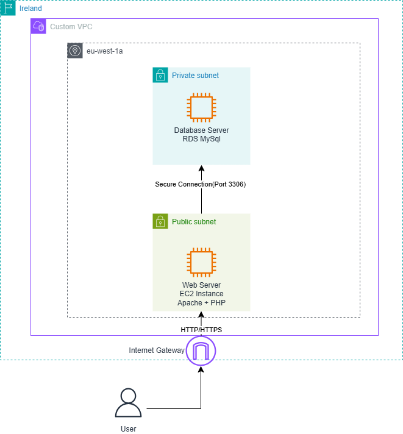
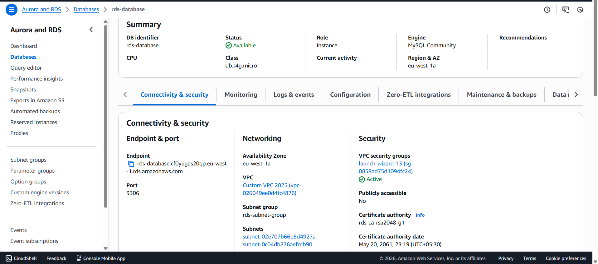
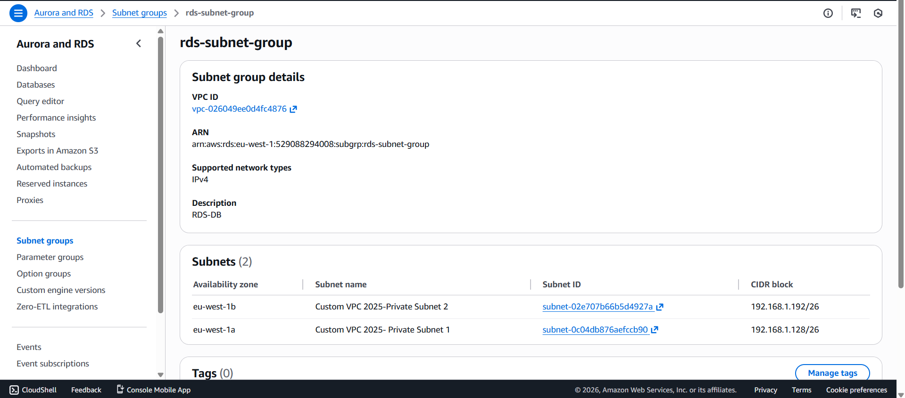
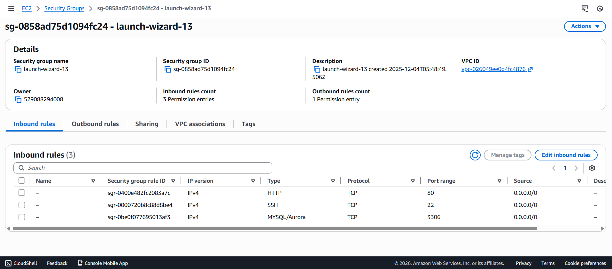
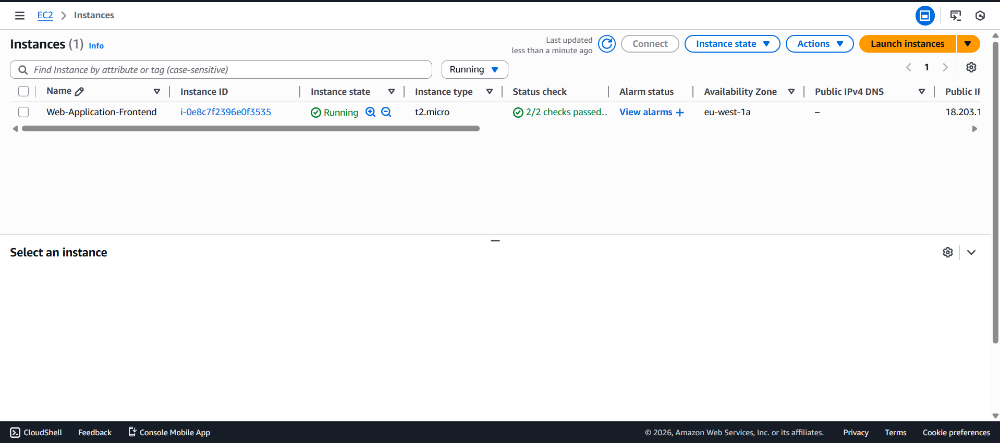
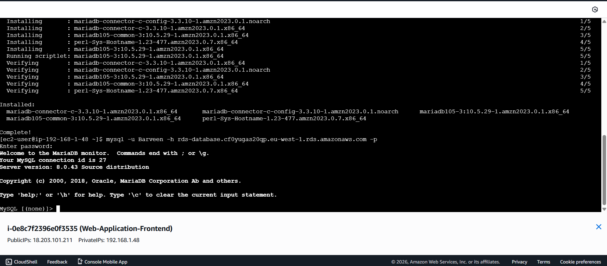
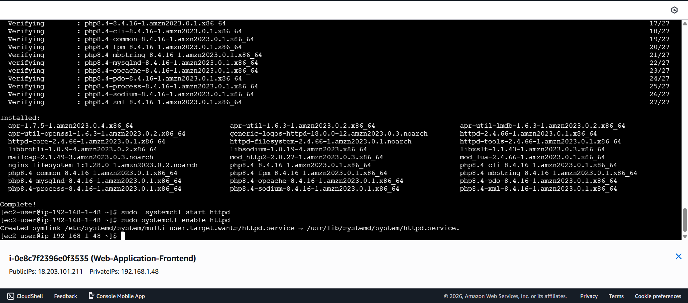
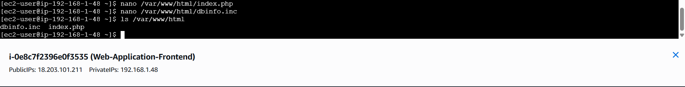
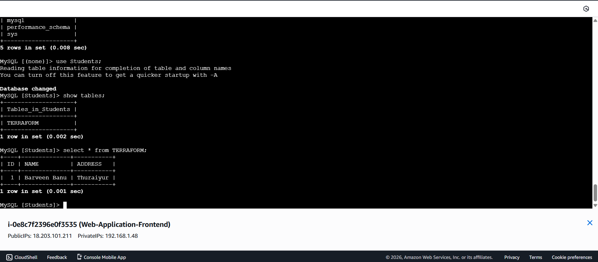
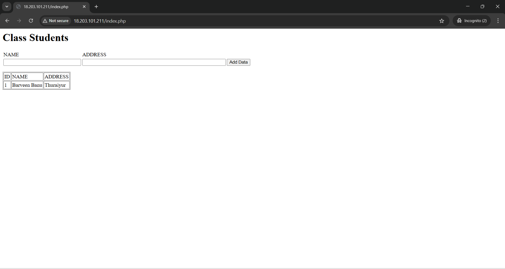

### TWO TIER WEB APPLICATION ARCHITECTURE (AWS RDS MySQL Integration with EC2)

##  Project Overview

This project demonstrates how to connect an **Amazon EC2 instance** to an **Amazon RDS MySQL database** using **PHP (MariaDB client)** in a secure **VPC private subnet architecture**. The EC2 instance runs Apache and PHP, and dynamically fetches data from the RDS MySQL database using SQL queries.

This is a **real-world 2-tier architecture** commonly used in production environments.

---


##  Architecture Diagram




---


##  Implementation Steps

### Step 1: Create RDS MySQL Database
- Engine: **MySQL**
- DB Instance Identifier: `my-rds-db`
- Enable **private access only**
- Disable **public accessibility**





---


### Step 2: Create DB Subnet Group
- Selected **private subnets only**
- Associated with the **same VPC as EC2**





---


### Step 3: Configure Security Groups

**RDS Security Group**
- Allow inbound **MySQL (3306)** from **EC2 Security Group**

**EC2 Security Group**
- HTTP (80) → Anywhere
- SSH (22) → My IP only





---


### Step 4: Launch EC2 Instance
- Amazon Linux 
- Public subnet
- Attached EC2 security group





---

### Step 5: Install MariaDB Client on EC2

- Installed **MariaDB client** on the EC2 instance
- Used to test and verify connectivity between EC2 and RDS MySQL





---

### Step 6: Install Apache and PHP on EC2

- Installed **Apache Web Server** to handle HTTP requests
- Installed **PHP** to process dynamic application logic
- Enabled and started the Apache service





---


### Step 6: Place `index.php` in Apache Document Root

- Created the PHP application file `index.php`
- Placed the file in the default Apache document root:

```text
/var/www/html/





---

### Step 7: Connect EC2 to RDS MySQL

- Connected to the RDS MySQL database from the EC2 instance
- Used the **RDS endpoint** as the database host
- Successfully authenticated using database credentials
- Executed SQL commands and received output from the database





---

### Step 8: Access Application Using EC2 Public IP

- Opened a web browser
- Entered the **EC2 public IP address** in the address bar
- Apache served the PHP application
- PHP executed SQL queries and fetched data from RDS MySQL
- Database output was successfully displayed in the browser





